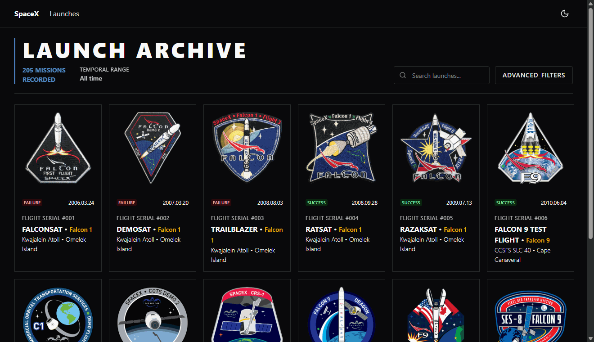

# SpaceX Launch Archive

SPA para consultar o histórico de lançamentos da SpaceX, construída com React, TypeScript e Vite.



## Como rodar

```bash
# 1. Instalar dependências
pnpm install

# 2. Configurar variáveis de ambiente
cp .env.example .env
# Editar .env e definir:
# VITE_API_BASE_URL=https://api.spacexdata.com/v4

# 3. Iniciar o servidor de desenvolvimento
pnpm dev
```

A aplicação estará disponível em `http://localhost:5173`.

## Scripts disponíveis

| Script    | Comando                          | Descrição                           |
| --------- | -------------------------------- | ----------------------------------- |
| `dev`     | `vite`                           | Servidor de desenvolvimento com HMR |
| `build`   | `tsc -b && vite build`           | Type-check + build de produção      |
| `preview` | `vite preview`                   | Preview local do build de produção  |
| `lint`    | `eslint .`                       | Linting via ESLint                  |
| `format`  | `prettier --write .`             | Formatação via Prettier             |
| `gifs`    | `node scripts/generate-gifs.mjs` | Gera o GIF único da seção Demo      |

## Stack e design system

| Camada        | Tecnologia            |
| ------------- | --------------------- |
| Framework     | React 19 + TypeScript |
| Bundler       | Vite 8                |
| Roteamento    | React Router v7       |
| Data fetching | TanStack Query v5     |
| HTTP client   | Axios                 |
| Design system | **Chakra UI v3**      |
| Testes        | Vitest + MSW          |
| Lint/Format   | ESLint + Prettier     |

### Por que Chakra UI?

- API declarativa com props de estilo — produtividade alta sem CSS externo.
- Suporte nativo a dark mode via `next-themes`.
- Componentes acessíveis por padrão (foco, aria, teclado).
- Boa integração com TypeScript (props tipadas).

## Funcionalidades

### Lista de lançamentos

- Listagem paginada com cards visuais (imagem, nome, status, rocket, launchpad, data).
- Busca por nome com debounce (400ms).
- Filtros avançados via drawer: status (sucesso/falha), agenda (próximos/passados), intervalo de datas.
- Paginação com navegação anterior/próxima.
- Estados de loading (skeleton), erro (retry) e empty state.
- Filtros persistidos na URL via query string — compartilhável e preservado ao voltar do detalhe.

### Detalhe do lançamento

- Carregamento por ID via API com populate de rocket, launchpad e crew.
- Hero com patch da missão, flight serial, nome e descrição.
- Stats: status (com indicador animado), data, rocket e launch site.
- Galeria de fotos da missão (Flickr) quando disponível.
- Composição da tripulação com fotos e links para Wikipedia.
- Links de recursos: webcast, wiki, artigo.
- Botão voltar que preserva o estado da lista.

### UI/UX

- Dark mode com toggle persistente.
- Layout responsivo (mobile-first).
- Navegação por teclado nos cards (Tab + Enter/Space).
- Header sticky com navegação e toggle de tema.

## Estrutura do projeto

```
src/
├── components/
│   ├── layouts/          # AppShell (header + main)
│   └── ui/               # Componentes reutilizáveis (PreloadedImage, FilterSelect, DateInput, etc.)
├── features/
│   └── launches/
│       ├── components/
│       │   ├── list/     # LaunchCard, Filters, Pagination, Skeleton, EmptyState, ErrorState
│       │   └── detail/   # Hero, Stats, Gallery, Crew, Resources, Skeleton
│       ├── hooks/        # useLaunches, useLaunchesPage, useLaunchDetail
│       ├── pages/        # LaunchesPage, LaunchDetailPage
│       ├── services/     # launches.service (+ testes)
│       ├── types/        # Launch type
│       └── utils/        # launch.utils (imagem, status, data)
└── lib/                  # Axios instance
```

## Limitações e próximos passos

### Limitações atuais

- Testes cobrem apenas a camada de service (unit + MSW). Não há testes de componente ou integração com RTL.
- Não há Error Boundary global — erros não capturados crasham a aplicação.
- Sem metadados por rota (title/description dinâmicos).
- Galeria do detalhe não possui lightbox/zoom.
- O campo `type` do rocket vindo da API é sempre `"rocket"` (literal), então não é exibido.

### Próximos passos

- Expandir testes para componentes e integração (Vitest + RTL + jsdom).
- Adicionar Error Boundary com fallback UI.
- Implementar metadados por rota via React Helmet.
- Adicionar Storybook para documentação visual de componentes.
- Explorar micro-frontends (Module Federation) para escalar a arquitetura.
- Adicionar pipeline CI/CD (GitHub Actions) com lint, test e build.
